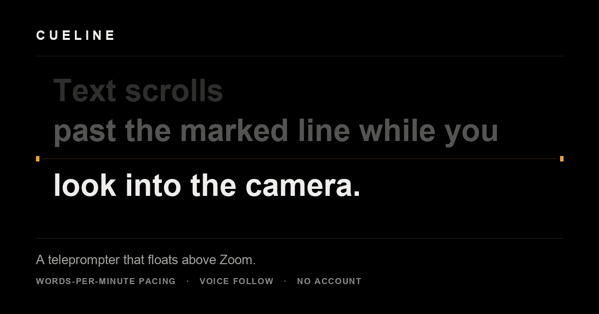

# Cueline



A teleprompter that floats above Zoom.

**→ [Open Cueline](https://ihelfrich.github.io/cueline/)** — no install, no account, no upload.

Paste a script, press **Float over Zoom**, and the prompter moves into a small
always-on-top window you can park directly under your webcam. It stays in front
of Zoom even in full screen, so you read your script while looking at the lens
instead of at the bottom of your screen.

---

## What it does differently

Three things go wrong when you present from a script.

You lose your place. Cueline fixes the reading line rather than the text: the
line you are on stays put while the script moves past it, text you have already
said is dimmed, and headings are jumpable with one key.

You run over time. Speed is set in words per minute, so the number is exact. 700
words at 140 wpm runs five minutes, whatever the type size or column width. Give
it a target length and it reports the rate you need and your drift against it as
you speak.

You cannot reach the controls, because Zoom has the keyboard. The floating window
carries its own transport, and voice follow can drive the script for you.

## Screen sharing

A web page cannot ask the operating system to exclude it from capture. A native
application can make that request, but on current macOS it is not a guarantee.
The reliable rule is therefore:

> In Zoom, share a window or a single browser tab. Not the entire screen.

A window share carries only the window you nominate, so the floating prompter is
not in it. An entire-screen share carries everything on the screen. Cueline puts
this in front of you once, the first time you float the prompter.

If the prompter must never enter a whole-display capture, put it on a physical
display or companion device that is not being shared. `NSWindowSharingNone`
used to cover this case, but modern ScreenCaptureKit clients may capture the
window despite that flag.

## Using it

1. **Write or paste your script.** Drag a `.txt` or `.md` file onto the page and
   it loads. Everything is saved in your browser as you type.
2. **Set a target length** if you have one. The editor shows the words-per-minute
   you need to hit it.
3. **Press "Float over Zoom"** and drag the window under your webcam. Keep it
   narrow — the less your eyes travel, the more you look like you are just
   talking.
4. **Share a window or a tab in Zoom**, then start it rolling.

### Script formatting

Plain text, close enough to Markdown that your script stays readable anywhere.

| You write | You get |
| --- | --- |
| `# Heading` | a section you can jump between |
| `> Cue` | a note to yourself — dimmed, never counted in the timing |
| `---` | a divider, e.g. "advance the slide" |
| `==stress==` | a word to hit |
| `/` and `//` | a breath, and a full stop — both charged to the running time |
| `Name{NAY-muh}` | how to say it, set above the word, shown but never spoken |
| `[direction]` | a note to yourself mid-line — shown, never spoken |
| `**bold**` `*italic*` | emphasis |
| `- item` | a bullet |

Nothing the prompter shows as unspoken is counted: headings, cues, directions
and pronunciation guides are all excluded, so the timing reflects only what you
will actually say. Marked pauses are the opposite — they are silence you will
really take, so they are added to the running time.

### Sense lines

Lines break where a phrase breaks, not where the column runs out.

This is how broadcast copy has been set for sixty years, and the reading
research agrees on why. When you read aloud your eye runs ahead of your voice to
the end of the current phrase and then waits — the eye-voice span (Buswell 1920;
Levin & Turner 1968; Laubrock & Kliegl 2015). The unit it buffers is the phrase,
because intonation, phrase-final lengthening and breath are all planned over a
whole phrase. Breaking at the container edge hands you the phrase boundary as it
arrives, which is a phrase too late to plan anything.

Cueline breaks at terminal punctuation, at clause boundaries, and before
conjunctions and prepositions, capping a line at nine words. You can override it
with `/` and `//` anywhere.

### On highlighting the word you are saying

There is a setting for it. It is off, and it should stay off.

Marking the current word tells your eye to go where your voice already is — it
drives the eye-voice span toward zero, which is the measured signature of an
unskilled oral reader: flat pitch, breath in the wrong places. A moving
highlight is also one of the strongest involuntary attention cues there is, so
it is not a suggestion your eye can decline. And the mark would often be wrong:
in timed mode the position is inferred from a clock, and in word-follow mode the
tracker knows the *trailing* edge of what you have said, so the mark would sit
behind your eye and pull it backwards.

The parts of speed-reading that do transfer to reading aloud — a fixed reading
position, an externally imposed rate, and a short line — are already the three
things this product is built on.

### Keyboard

| Key | Does |
| --- | --- |
| `Space` | start / stop |
| `↑` `↓` | faster / slower |
| `←` `→` | previous / next section |
| `J` `K` | nudge back / forward one line |
| `R` | back to the top |
| `M` | mirror (for teleprompter glass) |
| `F` | full screen |
| `+` `−` | text size |
| `Esc` | close a dialog, or the floating window |

Keys work when the prompter window or the main page has focus. While Zoom has
focus, use the buttons on the floating window, or let voice follow drive it.

## Voice follow

Two modes, because they make opposite trade-offs.

### Pace — the default

The script advances only while you are actually speaking, at the rate you set,
and holds the instant you stop. Pause, take a question, go off on a tangent —
it waits. It cannot know *which* word you are on, so it will not correct drift,
but it never guesses either.

It works by opening the microphone with `getUserMedia` and measuring input
level against an adaptive noise floor. Nothing is transcribed and nothing
leaves your machine. Crucially, `getUserMedia` is designed for concurrent use
and accepts a specific device, so **pace follow will not interrupt your call** —
and you can point it at a different microphone from the one carrying the call
if you want them fully isolated.

### Words — exact tracking, with a real cost

Word-level tracking keeps the line you are actually saying on the reading line.
Speak, and it follows; leave the script, and it stops and waits rather than
guessing; return, and it finds you again.

**It will take the microphone.** Browser speech recognition always opens the
default input, gives no way to choose a device or hand it an existing stream,
and starting it can pull the microphone away from whatever else is using it —
so switching it on mid-call can mute you in Zoom or Meet. Use it to rehearse,
or only when the call audio is on a different device. Speech is also
transcribed by your browser's recognition service, so it leaves your machine.
Cueline says all of this in the settings panel, next to the switch.

Under the noise, three things make word tracking feel calm rather than twitchy:

**Predict and correct.** Confirmations arrive in bursts a second or two apart.
Moving only on confirmation gives a stop-start crawl that is horrible to read
against, so between confirmations Cueline keeps gliding at the pace it measured
from your last few, and each new match is a small correction rather than a jump.

**Lock states and re-acquisition.** When it can no longer place what it hears it
says so, stops moving, and widens its search — first a few sentences, then a few
paragraphs, then the whole script. A tracker that only looks just ahead of
itself strands you the moment you ad-lib.

**Asymmetric trust.** Moving forward on a decent match is cheap to recover from.
Moving backward is not — a repeated phrase throwing you into text you already
read is what makes people abandon voice prompters. Backward jumps need a
near-perfect match.

Set your spoken language in Settings; accuracy falls off badly on the wrong one.
Word mode is Chromium-only (Chrome, Edge, Arc, Brave). Pace mode works anywhere
`getUserMedia` does, including Safari and Firefox.

## Tests

```bash
node test/engine.test.js
```

The app is plain browser files with no build step, so the tests lift the real
function bodies out of `app.js` and `script-parse.js` and exercise those rather
than a re-implementation — if a function is renamed the extraction fails, which
is itself useful. They
cover the parser, the words-per-minute timing identity, and the voice tracker
(including re-acquisition and the backward-jump guard).

## The desktop shell — actual transparency

Everything above runs in a browser. Four things do not, and cannot, however the
page is written:

- **A genuinely transparent window.** A browser's Picture-in-Picture window is a
  real OS window with an opaque backing store. No CSS and no API can make it
  see-through.
- **Best-effort native capture protection.** This still helps with older
  capture paths, but it is not a whole-display guarantee on current macOS.
- **Click-through**, so the overlay can never take a click meant for Zoom.
- **Global hotkeys** that work while Zoom holds the keyboard.

`desktop/` is a small Electron shell that loads the *same files* as the web app
and adds exactly those four powers, and nothing else. The prompter, the timing
model, sense lines, voice follow and the whole interface are identical.

```bash
cd /Users/ian/Developer/cueline/desktop && npm install && npm start
```

(Use the full path. On a case-insensitive macOS filesystem, `cd desktop` from
your home directory lands you in `~/Desktop`.)

The desktop app has two deliberately different states:

- **Arrange** makes the otherwise transparent window concrete. Its amber
  outline and eight resize targets show the exact bounds; drag the top rail to
  move it, drag any edge or corner to resize it, choose Compact / Standard /
  Wide, or place it directly under the camera. The Backdrop slider changes only
  the black reading panel from completely clear to fully opaque — the type
  stays fully opaque and crisp.
- **Present** removes every control and border, locks the geometry, gives mouse
  and keyboard focus back to Zoom, and passes all clicks through to whatever is
  underneath. `⌃⌥I` switches between the two states.

The first launch opens in Arrange at a focused, lens-centred size instead of
reviving geometry from older builds. Press **Done** when the words, backdrop,
and eye-line are right. From then on Cueline remembers the bounds and opacity.

In Present, the script sits under your camera, stays above full-screen Zoom,
and passes clicks through to whatever is underneath. Cueline enables Electron's
capture-protection flag, which maps to `NSWindowSharingNone`, but Electron warns
that modern ScreenCaptureKit clients can ignore it. Share the specific app
window you are presenting—not the entire display. For a hard guarantee, keep
the prompter on an unshared second display or companion device.

| Key | Does |
| --- | --- |
| `⌃⌥Space` | start / stop |
| `⌃⌥↑` `⌃⌥↓` | faster / slower |
| `⌃⌥←` `⌃⌥→` | previous / next section |
| `⌃⌥[` `⌃⌥]` | back / forward one line |
| `⌃⌥R` | back to the top |
| `⌃⌥=` `⌃⌥−` | type size |
| `⌃⌥I` | enter Arrange / finish arranging |
| `⌃⌥H` | hide / show |
| `⌃⌥Q` | quit |

If it is ever stuck, `pkill -f cueline/desktop` from any terminal, or Ctrl-C in
the terminal you started it from.

After setup, launch shows a short shortcut card and then takes it away. The menu
bar icon duplicates every important action, including opacity, size, camera
placement, reset, and Quit.

It has no Dock icon and Present never takes focus, so nothing you type goes to
it by accident — which also means Command-Q has nothing to quit. It lives in
the menu bar instead: every control is there for when the hotkeys have gone out
of your head thirty seconds before you go live.

`npm run dist` builds a `.dmg`. It will be unsigned, so the first launch needs
right-click then Open; signing needs your own Apple Developer credentials.

## Browser support

| | Floating always-on-top window | Pace follow | Word follow |
| --- | --- | --- | --- |
| Chrome, Edge, Arc, Brave | yes | yes | yes |
| Safari | no — opens a normal window | yes | no |
| Firefox | no — opens a normal window | yes | no |

The always-on-top window uses the [Document Picture-in-Picture API][dpip]. Where
it is unavailable Cueline falls back to an ordinary pop-up window and tells you
it will not stay on top by itself.

[dpip]: https://developer.mozilla.org/en-US/docs/Web/API/Document_Picture-in-Picture_API

## Running it yourself

Five static files, no build step, no dependencies.

```bash
git clone https://github.com/ihelfrich/cueline.git && cd cueline && python3 -m http.server 8777
```

Then open `http://localhost:8777`. Deploying it anywhere means copying the files
onto any static host.

Asset URLs carry a `?v=` query. **Bump it in `index.html` whenever you deploy a
change**, or returning visitors can end up running a cached `app.js` against
new markup — a state where the page loads without errors and silently does
nothing when clicked.

## Design

The reference is a broadcast prompter console rather than an application, and
two rules do most of the work.

**Saturation means live.** The interface is neutral monochrome. Amber appears
only when the prompter is armed or rolling — the play control, the reading
marks, the progress fill; red exists only as the voice tally lamp. Nothing that
is merely *available* is ever coloured. That is what leaves the reading line as
the most conspicuous thing on screen rather than one of a dozen competing
accents, and it is why the pace readout is an exposure meter — direction by
which side of centre, magnitude by length — instead of a green/amber/red pill.

**Structure is drawn with hairlines.** Square panels, 1px rules, a 4px rhythm,
tabular figures, and instrument labelling: a small tracked field name above a
large value. No card shadows, no gradients, no glass, no pills.

On the reading surface itself: the measure is capped at 17em so a line is five
or six words wide however large the window, because a long line forces the eye
to sweep back and re-find its place. Type is capped at `7.4vh + 8px`, so a short floating window
shrinks the text to keep several lines in view rather than showing you one and
a half; above roughly 450px of height the Size setting governs. Already-said text
is dimmed by a mask in viewport space, so the boundary falls exactly on the
reading line — to the pixel, mid-word — and costs nothing per frame. The
full-brightness band is a plateau more than two line-heights tall rather than a
peak at one gradient stop, so the line you are reading is never half-faded.

## Privacy

Your scripts and settings live in `localStorage` in your own browser. There is no
server, no analytics, and no network request of any kind — except the speech
recognition service if you switch voice follow on.

## Licence

MIT — see [LICENSE](LICENSE).
